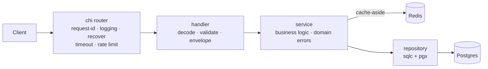

# identity

[](https://github.com/disillusioned-labs/identity/actions/workflows/ci.yml)


Authentication and identity service: users, organizations, membership and
invitations. It issues the RS256 tokens every other service in the organization
verifies, and it is the only service that owns those tables.

Its boundary is deliberately narrow — *who is this person, in which
organization, with what membership role*. Domain roles (approver, manager) and
product business rules belong to the product service, not here.

Built on [go-boilerplate](https://github.com/GtFoBAE05/go-boilerplate).
Layout is thin `cmd/`, private code in `internal/`, one grouped `platform/` for
infra — enforced by a linter, not by convention.

## Features

- **Type-safe SQL** — [sqlc](https://sqlc.dev) generates Go from raw SQL; no ORM, no reflection
- **Versioned migrations** — [goose](https://github.com/pressly/goose) files embedded in the binary, applied at boot (or from CI in prod)
- **Cache-aside Redis** — optional by config: disabled / degrade-gracefully / required
- **Full observability** — OTel traces and metrics pushed over OTLP (handler → service → SQL/Redis), trace-correlated `slog` logs
- **Hardened HTTP** — single response envelope, per-IP rate limiting, request timeouts, 1 MiB body cap, strict JSON validation (query params included)
- **Loopback-only pprof** — profiling on its own private port, off by default, never on the public API
- **Validated config** — every knob checked at boot, all errors reported at once, secrets redacted in logs
- **Guardrail CI** — lint, race tests, testcontainers integration suite, pinned `govulncheck`, sqlc drift check, image build, Dependabot
- **Zero-downtime shutdown** — readiness drain before the listener closes, then bounded HTTP drain and OTel flush

## Architecture



Every layer owns one job: handlers never touch the database, services never
touch HTTP, repositories never contain business rules. Domain errors carry their
own status and code (`service.Error`), so `internal/handler/respond.go` maps
them generically and never grows a case per resource.

## Quickstart

Prerequisites: Go 1.25+, Docker.

```bash
cp .env.example .env      # local settings; without it you get production defaults
docker compose up -d      # postgres + redis + jaeger + prometheus + otel-collector
go run ./cmd/api          # or: make run — applies goose migrations at boot
```

The `.env` step matters: boot-time migrations are **off** by default (production
should not have replicas racing to migrate), and `.env.example` is what turns
them on for local development.

Postgres binds host port **5433** and Redis **6380** (not the defaults) so they
never collide with natively installed instances.

### Endpoints

| Method | Path                 | Description                              |
| ------ | -------------------- | ---------------------------------------- |
| POST   | `/api/v1/users`      | Create user (409 on duplicate email)     |
| GET    | `/api/v1/users/{id}` | Get user (second call served from Redis) |
| GET    | `/api/v1/users`      | List users (`?limit=1..100&offset=`)     |
| PATCH  | `/api/v1/users/{id}` | Partial update (name and/or email)       |
| DELETE | `/api/v1/users/{id}` | Delete user (404 if it never existed)    |
| GET    | `/healthz`           | Liveness probe                           |
| GET    | `/readyz`            | Readiness (pings postgres + redis)       |

There is no `/metrics` on this port, or on any port — metrics are pushed to a
collector. See [Observability](#observability).

```bash
curl -X POST localhost:8080/api/v1/users -d '{"name":"alice","email":"alice@example.com"}'
curl localhost:8080/api/v1/users/1
```

## Stack

| Concern       | Choice                                                                 |
| ------------- | ---------------------------------------------------------------------- |
| HTTP router   | [chi](https://github.com/go-chi/chi) (stdlib-compatible)               |
| Database      | PostgreSQL via [pgx/v5](https://github.com/jackc/pgx) connection pool  |
| Query layer   | [sqlc](https://sqlc.dev) — type-safe Go generated from SQL             |
| Migrations    | [goose](https://github.com/pressly/goose) — embedded, applied at boot  |
| Cache         | Redis via [go-redis/v9](https://github.com/redis/go-redis), cache-aside |
| Config        | [Viper](https://github.com/spf13/viper) — env vars + `.env` for dev, validated at boot |
| Logging       | stdlib `log/slog`, JSON in prod, trace-ID correlated                   |
| Tracing       | OpenTelemetry → OTLP/gRPC (Jaeger, Tempo, any collector)               |
| Metrics       | OpenTelemetry → OTLP/gRPC push to a collector (no scrape endpoint)     |

## Layout

```
cmd/api/              Entry point: loads config, calls app.Run(cfg)
internal/
  app/                Lifecycle (app.go, stable) + DI wiring (di.go, grows per resource)
                      version.go holds -ldflags build provenance
  config/             Config loading + validation (env vars, .env for dev)
  platform/           Generic infra adapters — know nothing about this app
    postgres/         pgxpool construction + goose migration runner
    redis/            Redis client lifecycle (shared by all Redis consumers)
    cache/            JSON cache-aside helper (one consumer of the client)
    telemetry/        slog setup + OTel tracer/meter providers
  repository/         sqlc-generated queries (run `make sqlc`) + hand-written Store (tx wrapper)
  service/            Shared service bits: service.Error type, storage-error helpers
    user/             User business logic: service.go, model.go, input.go
  handler/            Shared HTTP plumbing: respond, validate, page
    health/           Liveness/readiness probes (readiness drains on shutdown)
    user/             /users resource: handler.go, request.go, response.go, routes.go
  server/             Router, middleware, http.Server, private pprof listener
db/
  migrations/         goose SQL migrations (embedded, applied at boot)
  queries/            sqlc query sources
deploy/               OTel collector, Prometheus, and alert rule configs
```

`internal/platform/` is the one grouped directory, and it earns the nesting by
having a rule a linter can check: **nothing under it may import
`github.com/disillusioned-labs/identity/internal`**. A `depguard` rule fails the build otherwise. That is
what keeps infra constructible from a test with no `config.Config` — and what
stops `platform/` from decaying into the `util/`-style dumping ground these
directories usually become. A second rule denies `internal/config` to
`handler/`, `service/` and `repository/`: only the composition root reads config.

## API behavior

### Response envelope

Every API response has exactly one shape, enforced centrally in
`internal/handler/respond.go` — resource handlers never touch the encoder:

```jsonc
// success                              // failure
{"data": {...}}                         {"error": {"code": "NOT_FOUND", "message": "..."}}
{"data": [...], "meta": {"limit": 20,   {"error": {"code": "VALIDATION_FAILED", "message": "...",
           "offset": 0}}                           "fields": {"email": "is required"}}}
```

Clients branch on `error.code` (machine-readable), never on `message`.
Health probes (`/healthz`, `/readyz`) intentionally skip the envelope.

### Request guardrails

- **Validation**: DTOs carry [go-playground/validator](https://github.com/go-playground/validator)
  tags; failures return 422 with per-field messages. Unknown JSON fields are
  rejected (typos fail loudly). Bodies over 1 MiB return 413.
- **Pagination**: `?limit`/`?offset` are validated, not clamped — a malformed or
  out-of-range value returns 422 naming the field, rather than silently serving
  a page the client never asked for.
- **Rate limiting**: the `/api/v1` subtree is limited per client IP via
  [httprate](https://github.com/go-chi/httprate); probes are never limited.
  Over the limit → `429` with the `RATE_LIMITED` envelope. Configure under
  `ratelimit`; disable with `RATELIMIT_ENABLED=false`. Counters are
  **per process**: N replicas allow N×`requests`, so use a shared store
  ([httprate-redis](https://github.com/go-chi/httprate-redis)) if you need a
  hard global cap.
- **Timeouts**: every request gets a context deadline (`server.request_timeout`);
  downstream pgx/redis calls abort when it fires and the client gets a `504`
  with the `TIMEOUT` code. A client that disconnects gets no body written.

### Error codes

`error.code` is the stable contract. Transport-level codes (`BAD_REQUEST`,
`VALIDATION_FAILED`, `NOT_FOUND`, `METHOD_NOT_ALLOWED`, `PAYLOAD_TOO_LARGE`,
`RATE_LIMITED`, `TIMEOUT`, `INTERNAL`) live in `internal/handler`. Domain codes
live on the error itself:

```go
// in your resource's service package — no change to the handler layer
var ErrOrderLocked = service.NewError("ORDER_LOCKED", http.StatusConflict, "order is locked")
```

`WriteServiceError` finds the mapping with `errors.As`, so wrapping with `%w`
preserves it and adding a resource never touches shared code.

## Configuration

Everything is configured through environment variables. `.env.example` lists
every one of them, with comments:

```bash
cp .env.example .env      # local development; .env is git-ignored
```

**Precedence: environment variable > `.env` > built-in default.** The built-in
defaults are the production-safe set (`POSTGRES_MIGRATE=false`, JSON logs at
info, `PPROF_ENABLED=false`), so a container that ships no file and sets only
what it needs is already sane. `.env.example` is what opts *local development* into the
convenient values (debug text logs, migrate-on-boot).

There is deliberately **one vocabulary**. An earlier revision had a `config.yaml`
of dotted keys that production never read — every knob had two spellings and the
env names were documented nowhere. `.env` is parsed into a map and layered in as
defaults (never via `os.Setenv`, which would make `Load` non-idempotent), so a
real environment variable still wins for free.

Names are **unprefixed**, which means they share a namespace with everything else
in the environment. Two sections are named deliberately as a result, in opposite
directions, and should stay that way:

- **`SERVICE_NAME` / `SERVICE_ENV`** rather than bare `NAME` / `ENV`, which are
  generic enough that unrelated tooling sets them.
- **`OTEL_*`, using the OpenTelemetry SDK's own names with the SDK's own
  meaning** — `OTEL_EXPORTER_OTLP_ENDPOINT`, `OTEL_TRACES_SAMPLER`,
  `OTEL_SDK_DISABLED`. Inventing a private spelling would mean an operator who
  sets the real variable from memory is silently ignored. The price is owing the
  spec's semantics: `OTEL_METRIC_EXPORT_INTERVAL` is **milliseconds**, not a Go
  duration, and `OTEL_EXPORTER_OTLP_ENDPOINT` **requires a scheme** because that
  is what selects TLS. Both are validated at boot. `OTEL_SERVICE_NAME` is the
  one exception, documented in `.env.example`: `SERVICE_NAME` owns the service
  identity because the logger uses it too.

When adding a key, check the resulting name against what your platform injects.
Kubernetes sets `<SERVICE>_PORT` and `<SERVICE>_SERVICE_HOST` for every Service in
the namespace (`enableServiceLinks`, on by default), so a key spelling out to
`POSTGRES_PORT` or `REDIS_PORT` would be silently overwritten with something like
`tcp://10.96.0.1:5432`. The current names (`POSTGRES_DSN`, `REDIS_ADDR`, …) avoid
that collision.

Adding a knob: register it in `setDefaults` with the value production wants —
registration is mandatory, since Viper's `AutomaticEnv` only resolves keys it
already knows — validate it, then add the dev value to `.env.example`. Two CI
tests keep that file honest: it must produce a valid config, and every key in it
must be one the app actually reads.

Every key is **validated at boot** and all problems are reported together, so a
bad override fails fast with the full list instead of degrading silently:
port ranges, enum values (`app.env`, `log.level`, `log.format`,
`postgres.query_exec_mode`, `redis.mode`), `otel.sample_ratio` ∈ [0,1], and
cross-field rules — `request_timeout < write_timeout` (so the 504 can still be
written) and `shutdown_timeout >= request_timeout` (so shutdown outlasts one
in-flight request). Config structs holding secrets implement `slog.LogValuer`,
so logging a config can't leak a DSN password.

Behind a transaction-mode connection pooler (pgbouncer, RDS Proxy), set
`postgres.query_exec_mode` to `exec` or `simple_protocol` — pgx's default
prepared-statement cache breaks there.

### Dependency policy

- **Postgres is a hard dependency**: unreachable at startup → the process
  exits (fail-fast, let the orchestrator restart it).
- **Redis is a soft dependency**, controlled by `redis.mode`:
  - `disabled` — no Redis at all, service runs uncached.
  - `optional` (default) — log a warning and degrade to uncached reads
    when unreachable; `/readyz` reports Redis as `degraded` but stays 200.
  - `required` — unreachable Redis is fatal at startup.

## Observability

- **Traces**: Jaeger UI at <http://localhost:16686> — spans run
  handler → service → SQL/Redis, correlated with logs via `trace_id`.
- **Metrics**: Prometheus at <http://localhost:9090>, scraping the collector at
  `:8889` — the app pushes there over OTLP.
- **Profiling**: pprof on a private loopback listener, off by default — set
  `PPROF_ENABLED=true`, then
  `go tool pprof http://localhost:6060/debug/pprof/profile`. While disabled
  nothing is created: no socket, no goroutine.

Both signals leave the process the same way — an OTLP/gRPC push to the
collector, which fans traces out to Jaeger and re-exposes metrics for Prometheus
to scrape. **The app serves no `/metrics`, on any port.** A test asserts it stays
that way.

That is the deliberate trade:

| | pull (what this used to be) | push (what it is) |
| --- | --- | --- |
| exposure | unauthenticated endpoint on the public port, leaking route patterns and pool sizes | one outbound connection, nothing listening |
| liveness | `up` for free — Prometheus knows a target it cannot reach | no `up`; absence of series is the only signal |
| failure mode | collector dies, metrics keep accumulating locally | collector dies, metrics are gone |

Losing `up` is the part that costs something, and `deploy/rules.yml` handles it
explicitly rather than pretending otherwise: `AppMetricsMissing` fires on
`absent(go_goroutine_count)`, and `CollectorDown` — the collector *is* still
scraped — is what distinguishes a dead app from a dead pipeline. In Kubernetes,
restarting a wedged process is the liveness probe's job anyway, not an alert's.

pprof remains on its own private listener, off by default, `127.0.0.1` only. It
has no bind-host option on purpose: reach it with `kubectl port-forward`, never
by widening the bind.

### What gets exported

Nothing here is hand-rolled — every series comes from an instrumentation library
wired in `internal/platform`, so a new resource inherits all of it for free.
Names below are after the collector's OTLP-to-Prometheus translation.

| Series | From | Answers |
| --- | --- | --- |
| `http_server_request_duration_seconds{http_route,...}` | otelhttp | rate, errors, latency (RED) |
| `pgxpool_acquired_connections`, `pgxpool_max_connections`, `pgxpool_empty_acquire_total`, ... | `otelpgx.RecordStats` | pool saturation |
| `db_client_connections_usage{db_system="redis"}`, ... | `redisotel.InstrumentMetrics` | Redis client pool |
| `go_goroutine_count`, `go_memory_used_bytes`, ... | `contrib/instrumentation/runtime` | goroutines, heap, GC |
| `target_info{service_version,vcs_ref_head_revision}` | OTel resource, stamped from `-ldflags` | which build a series came from |

Runtime metrics are started explicitly in `telemetry.Setup`. Under a scrape
endpoint the Prometheus client library contributes its Go collector by default;
pushing over OTLP nothing does, and goroutine count and heap size would simply
not exist.

Pool saturation is the one worth internalising: an exhausted pool never surfaces
as an error, only as latency *inside* the acquire, so `http_*` alone cannot tell
"the database is slow" from "we ran out of connections to it".

Two labels are load-bearing and neither is free under push:

- **`http_route`** — otelhttp wraps the router from the outside and never sees
  chi's pattern. The `routePattern` middleware feeds it back through otelhttp's
  Labeler after routing; without it every endpoint shares one histogram.
  Unmatched paths are left unlabelled on purpose, so a scanner walking random
  URLs cannot mint a series per path.
- **`instance`** — scraping derived it from the target address. Pushing, only
  the process can say who it is, so `telemetry.Setup` stamps
  `service.instance.id` from the hostname. Without it every replica collapses
  onto one series and per-pod problems average away. `prometheus.yml` needs
  `honor_labels: true` or the scrape overwrites it with the collector's identity.

`target_info` is what turns a regression into a deploy. Join it in PromQL:

```promql
job:http_request_duration_seconds:p99_5m
  * on(instance) group_left(service_version) target_info
```

`deploy/rules.yml` ships the recording and alerting rules for exactly these
series — error ratio, p99, pool utilisation, liveness, plus a
`PostgresPoolStarved` leading indicator. Prometheus loads it from the compose
stack. Recording rules exist so a dashboard panel and its alert evaluate the
*same* expression; validate edits with
`promtool check rules deploy/rules.yml`.

**Adding a metric of your own:** build the instrument once in the service
constructor (never per request), keep the attribute set bounded — an id, email
or `trace_id` as a label is one time series per value and will take down the
collector — and first check the metric is not already derivable from
`http_server_*`, which sees every request the API answers.

### Shutdown

On SIGTERM the app fails `/readyz` first, keeps serving for
`server.drain_delay`, and only then closes the listener. Kubernetes removes
endpoints asynchronously, so closing immediately is the usual cause of 502s
during a rolling deploy. Liveness stays 200 throughout — failing it would tell
the orchestrator to kill the process mid-drain. A second signal exits at once.

## Development

```bash
make test               # unit tests: go test -race ./... (fast, no Docker)
make test-integration   # integration suite (-tags integration, needs Docker)
make lint               # golangci-lint (CI pins the same version)
make sqlc               # regenerate internal/repository after editing db/queries/
make vuln               # govulncheck at the pinned version
make migrate-new name=x # scaffold a goose migration in db/migrations/
make migrate-up         # apply migrations to the local db
make build              # local binary with version/commit stamped in
make docker-build       # distroless production image, provenance included
```

Tool versions (goose, sqlc, govulncheck, golangci-lint) are pinned as Makefile
variables so local runs and CI can't drift. They stay out of `go.mod` on purpose:
sqlc's dependency tree would otherwise be downloaded by the Dockerfile's
`go mod download` on every image build.

The integration suite spins a throwaway `postgres:16-alpine` via
[testcontainers](https://github.com/testcontainers/testcontainers-go), applies
the goose migrations (guarding them too), and exercises the repository. See
`internal/repository/integration_test.go` — it is the template for new
resources.

### Migrations

Schema changes are goose SQL files under `db/migrations/` (`-- +goose Up` /
`-- +goose Down` in one file), embedded in the binary and applied at boot while
`postgres.migrate` is true — the default for local dev; disable it in prod and
run goose from CI instead — which is the default outside `.env.example`, so the
production image never migrates unless you ask it to. sqlc reads the same
migration files as its schema, so nothing is kept in sync by hand.

## Extending

- **New resource** (mirror the `user` vertical):
  1. `make migrate-new name=create_things` → write the up/down SQL
  2. Add queries in `db/queries/` → `make sqlc`
  3. Copy the layout of `internal/service/user/` and `internal/handler/user/`
     (handlers import their service aliased: `thingsvc ".../service/thing"`)
  4. Wire it: construct the service in `internal/app/di.go`, add a field to
     `server.Deps`, mount the routes in `internal/server/server.go` —
     `cmd/` and `app.go` stay untouched.
- **New binary** (worker, cron): add `cmd/<name>/main.go`, reuse `internal/`.

## Philosophy

Inherited from the boilerplate: make the decisions everyone agrees on, leave the
contested ones open. Not included by the base, and decided here:

- **Auth** — the boilerplate ships none on purpose. This service builds it:
  RS256 signing keys, a JWKS endpoint and key rotation, with verification living
  in the separate `authkit` library so no other service can mint tokens.
- **Swagger/OpenAPI** — annotation noise; pick your own spec workflow
- **Mock generators** — interfaces + hand-written fakes are enough (see the tests)
- **CORS / trusted-proxy handling** — depends on your deployment topology;
  add middleware in `internal/server/` to fit it
- **gRPC / message queues / workers** — add them when you need them. The
  lifecycle already runs on an `errgroup`, so a second long-running component is
  one `g.Go` away.
- **Distributed rate limiting** — the in-process limiter is honest about being
  per-replica; swap the store when a global cap actually matters

One complete example vertical (`user`) is the documentation: copy it, rename
it, ship. AI coding agents get their own guidance in [AGENTS.md](AGENTS.md).
